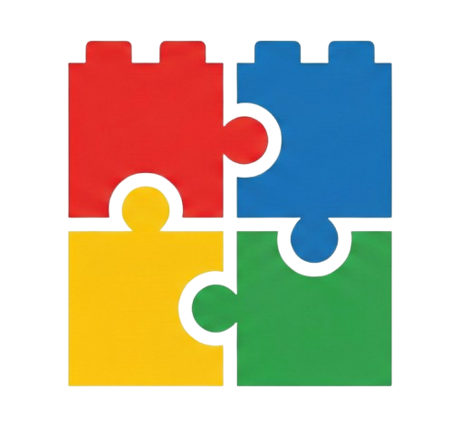

<div align="center">
  
  <h1>Gridhouse</h1>
</div>

A minimalist, interactive 3x3 grid game built with Next.js and Tailwind CSS. The grid features "Brutalist" aesthetics, a dot-matrix background, and complex ripple-effect logic.

## 🎮 Game Rules

Click on any box to increment its value. However, watch out for the ripple effects!

1.  **Direct Interaction**: Clicking a box increases its value by **1**.
2.  **Ripple (Right)**: If a box's value becomes divisible by **3**, the box to its **right** decreases in value by **1**.
3.  **Ripple (Down)**: If a box's value becomes divisible by **5**, the box **below** it increases in value by **2**.
4.  **Locking System**: Once a box reaches a value of **15 or higher**, it becomes **Locked**.
    *   Locked boxes turn **Red**.
    *   They cannot be clicked.
    *   They are immune to ripple effects from neighbors.

## 🎨 Visual System

The grid communicates state through a high-contrast color system:
- **Even Numbers (0, 2, 4...)**: Light Gray background.
- **Odd Numbers (1, 3, 5...)**: Dark Blue background with White text.
- **Locked (15+)**: Solid Red background with White text.

## 🖥️ UI Features

- **Brutalist Design**: Thick borders, heavy shadows, and bold typography.
- **System Log**: A real-time terminal-style logger on the right that tracks manual increments, ripple calculations, and lock events.
- **Dot Background**: A subtle, responsive radial dot grid that adapts to light and dark modes.
- **Responsive Layout**: Optimized for both mobile (stacked) and desktop (3-column grid) views.

## 🛠️ Tech Stack

- **Framework**: [Next.js 15](https://nextjs.org/) (App Router)
- **Styling**: [Tailwind CSS](https://tailwindcss.com/)
- **State Management**: React `useState` with immutable updates
- **Language**: [TypeScript](https://www.typescriptlang.org/)

## 📂 Project Structure

- `app/page.tsx`: Main page acting as the controller for the application.
- `components/`: Modular UI components (`GridBoard`, `Instructions`, `SystemLog`, `DotBackground`).
- `lib/grid-logic.ts`: Pure logic, types, and constants governing the game mechanics.
- `app/globals.css`: Tailwind configuration and global styles.

## 🚀 Getting Started

First, install the dependencies:

```bash
npm install
```

Run the development server:

```bash
npm run dev
```

Open [http://localhost:3000](http://localhost:3000) with your browser to play.
